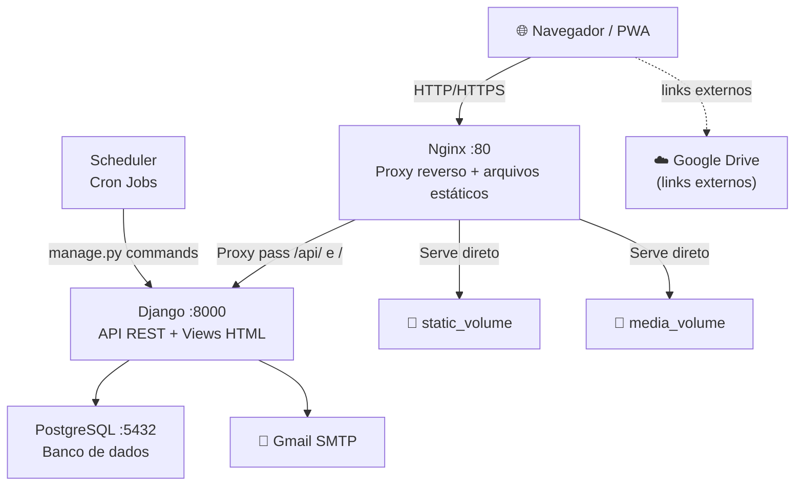
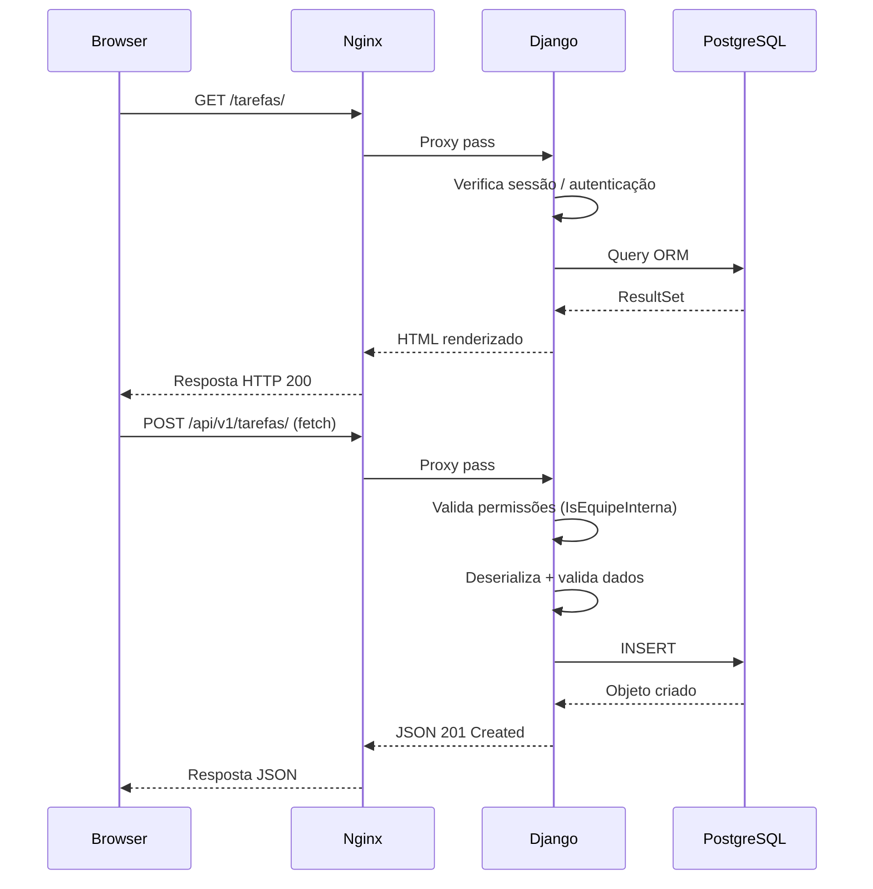
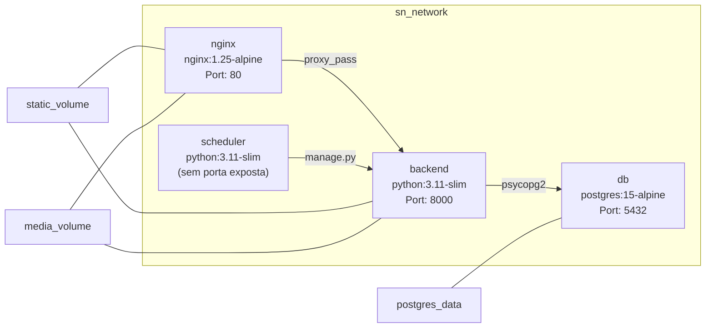

# Arquitetura do Sistema

[[index|← Início]]

## Stack Tecnológica

| Camada | Tecnologia | Versão |
|--------|-----------|--------|
| Backend | Django + Django REST Framework | 4.2 / 3.15 |
| Banco de Dados | PostgreSQL | 15 |
| Frontend | HTML + CSS + JavaScript (Vanilla) | — |
| Geração de PDF | WeasyPrint | 62.3 |
| Processamento de Imagem | Pillow | 10.4 |
| Servidor Web | Nginx | 1.25 Alpine |
| Containerização | Docker + Docker Compose | — |
| Runtime | Python | 3.11 slim |
| Agendamento | Cron (busybox crond) | — |

## Diagrama de Infraestrutura



## Estrutura de Pastas

```
sn-gestor/
├── backend/
│   ├── apps/
│   │   ├── accounts/        # Usuários e autenticação
│   │   ├── companies/       # Empresas e pagamentos
│   │   ├── tasks/           # Motor de tarefas (núcleo)
│   │   ├── dashboard/       # Painéis e metas
│   │   ├── postits/         # Quadro de recados
│   │   ├── relatorios/      # Geração de PDF
│   │   ├── portal/          # Portal do cliente
│   │   └── frontend/        # Views de roteamento HTML
│   ├── config/
│   │   ├── settings/
│   │   │   ├── base.py      # Configurações compartilhadas
│   │   │   ├── development.py
│   │   │   └── production.py
│   │   ├── urls.py          # URL dispatcher principal
│   │   ├── wsgi.py
│   │   └── asgi.py
│   ├── templates/           # Templates Django (HTML)
│   ├── static/              # CSS, JS, imagens, manifest PWA
│   ├── staticfiles/         # collectstatic output
│   ├── media/               # Uploads de usuários
│   ├── entrypoint.sh        # Script de inicialização do container
│   ├── requirements.txt
│   └── manage.py
├── nginx/
│   └── nginx.conf
├── docker-compose.yml
└── .env                     # Variáveis de ambiente (não versionado)
```

## Fluxo de Requisição



## Containers Docker



> [!warning] Produção
> O `entrypoint.sh` usa `manage.py runserver`. Para produção, substituir por **Gunicorn** com workers configurados.

## Autenticação

O sistema usa **autenticação baseada em sessão** do Django (cookies `sessionid` + `csrftoken`). Não há JWT.

```mermaid
sequenceDiagram
    participant B as Browser
    participant A as /api/v1/auth/login/
    participant S as Django Session

    B->>A: POST {email, senha}
    A->>S: authenticate(email, senha)
    S-->>A: Usuario object
    A->>S: login(request, user)
    S-->>B: Set-Cookie: sessionid=xxx; csrftoken=yyy
    Note over B: Todas as requisições seguintes incluem os cookies
```

## Jobs Agendados (Cron)

| Schedule | Comando | Descrição |
|----------|---------|-----------|
| `0 8 * * *` | `enviar_alertas_prazo` | Notifica tarefas com prazo amanhã (e-mail + notificação interna) |
| `0 8 * * 1` | `enviar_relatorio_semanal` | Relatório semanal de desempenho por e-mail (toda segunda-feira) |

Os jobs rodam no container `scheduler` e chamam `python manage.py <comando>` com o Django configurado.

---

Próximo: [[modelos-de-dados]]
