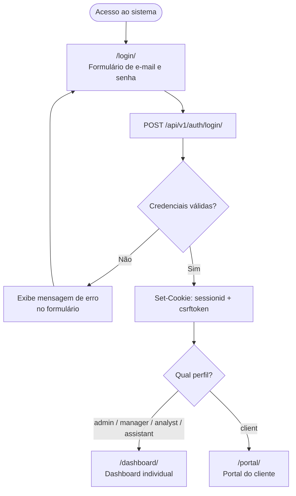
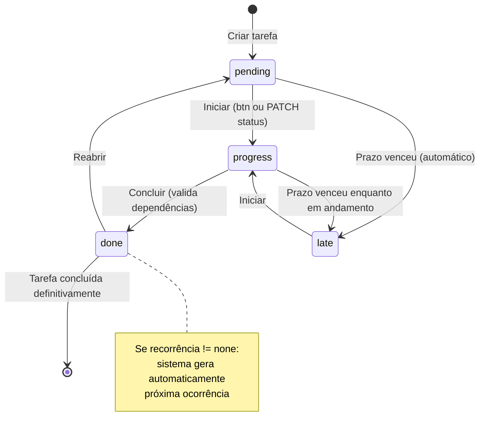
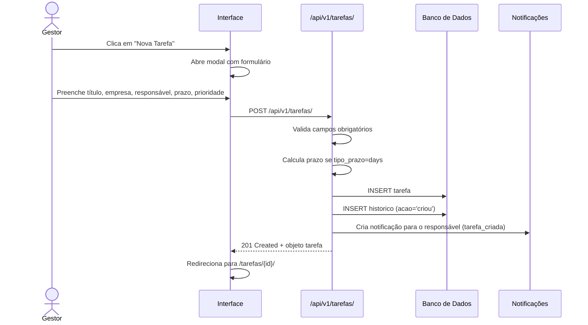
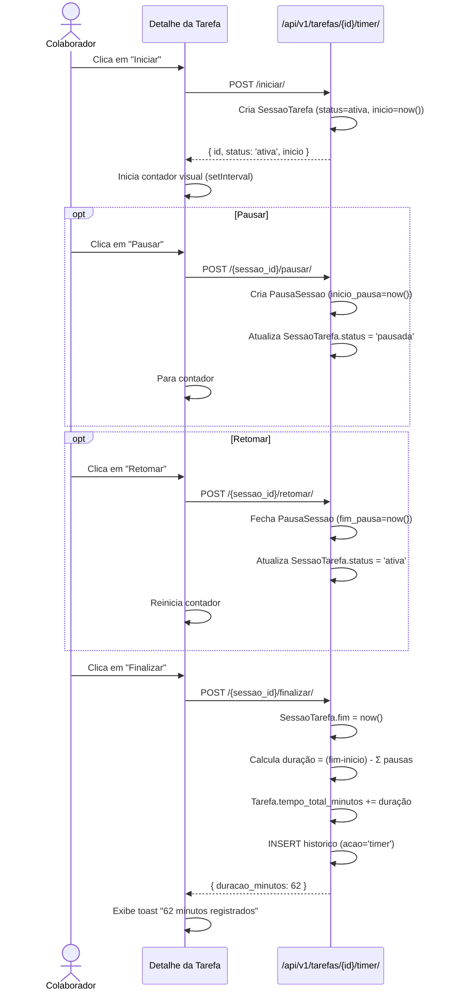
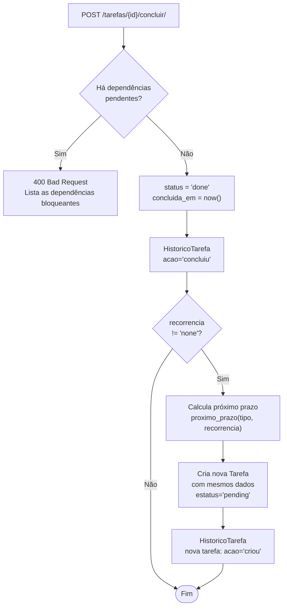
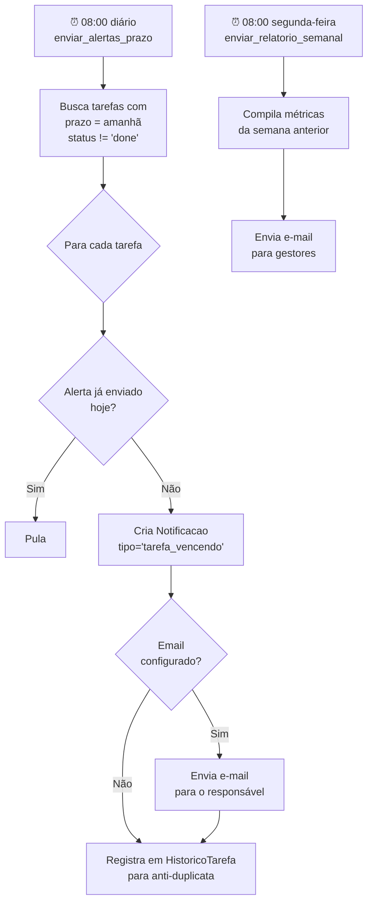
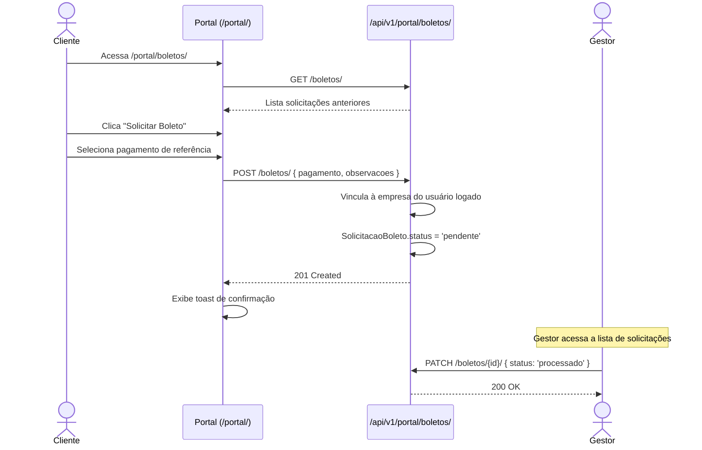
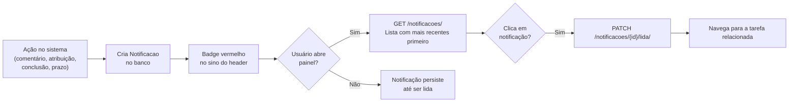

# Fluxos de Negócio

[[index|← Início]] · [[permissoes|Permissões]]

## 1. Login e Navegação

---

## 2. Ciclo de Vida de uma Tarefa

---

## 3. Criação e Atribuição de Tarefa

---

## 4. Fluxo do Timer de Trabalho

---

## 5. Conclusão com Recorrência

---

## 6. Alertas Automáticos (Cron)

---

## 7. Portal do Cliente — Solicitação de Boleto

---

## 8. Fluxo de Notificações

---

Próximo: [[deploy]]
