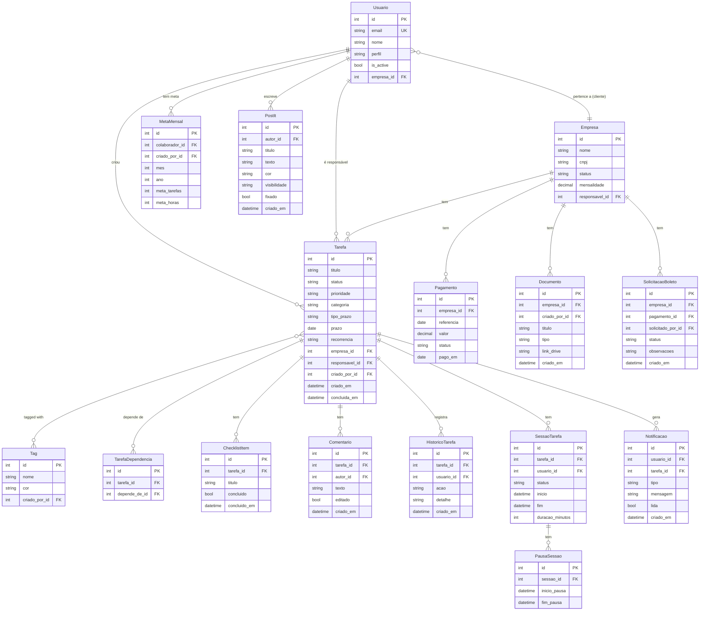
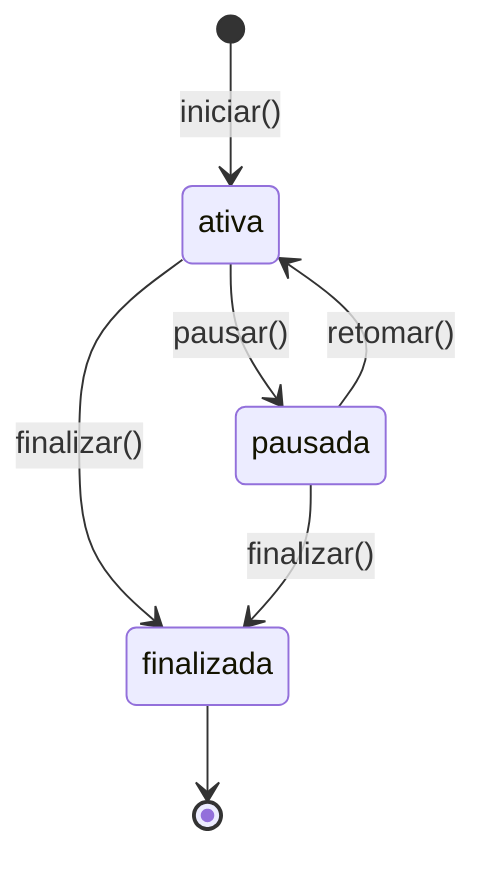

# Modelos de Dados

[[index|← Início]] · [[arquitetura|Arquitetura]]

## Diagrama ER



---

## Detalhamento por Modelo

### `Usuario`

Modelo customizado que substitui o `AbstractBaseUser` do Django. Autenticação por e-mail (sem `username`).

| Campo | Tipo | Descrição |
|-------|------|-----------|
| `email` | EmailField (unique) | Identificador de login |
| `nome` | CharField | Nome completo |
| `perfil` | CharField (choices) | `admin` · `manager` · `analyst` · `assistant` · `client` |
| `empresa` | FK → Empresa (null) | Apenas para perfil `client` |
| `is_active` | bool | Soft delete — desativação em vez de exclusão |
| `foto` | ImageField (null) | Avatar (processado com Pillow) |

**Properties úteis:** `iniciais`, `primeiro_nome`, `is_admin`, `is_gestor_ou_acima`, `is_equipe_interna`, `is_cliente`

---

### `Tarefa`

Entidade central do sistema.

| Campo | Tipo | Descrição |
|-------|------|-----------|
| `status` | choices | `pending` · `progress` · `done` · `late` |
| `prioridade` | choices | `low` · `medium` · `high` · `urgent` |
| `categoria` | choices | `fiscal` · `financeiro` · `contabil` · `folha` · `juridico` · `outros` |
| `tipo_prazo` | choices | `fixed` (data fixa) · `continuous` (contínuo) · `days` (X dias úteis) |
| `recorrencia` | choices | `none` · `weekdays` · `daily` · `weekly` · `biweekly` · `monthly` · `yearly` |
| `tempo_total_minutos` | int | Acumulado de todas as sessões finalizadas |
| `link_documento` | URLField (null) | Link do Google Drive |

> [!tip] Recorrência
> Quando uma tarefa recorrente é concluída, o sistema gera automaticamente a próxima ocorrência com prazo calculado por `proximo_prazo()`. O histórico é iniciado do zero.

---

### `TarefaDependencia`

Grafo de dependências entre tarefas. Uma tarefa pode depender de várias outras e só pode ser concluída quando todas as dependências estão com `status = 'done'`.

> [!warning] Validação
> O serializer impede dependência circular (A → B → A).

---

### `SessaoTarefa` + `PausaSessao`

Sistema de time tracking com granularidade de segundos.



A duração líquida é calculada descontando os intervalos de `PausaSessao`:

```
duracao = (fim - inicio) - Σ(fim_pausa - inicio_pausa)
```

O resultado é salvo em `duracao_minutos` (inteiro) e somado a `Tarefa.tempo_total_minutos`.

---

### `HistoricoTarefa`

Audit trail imutável. Toda mutação relevante gera um registro.

| `acao` | Quando é gerado |
|--------|----------------|
| `criou` | POST /tarefas/ |
| `editou` | PATCH /tarefas/{id}/ com campos alterados |
| `concluiu` | POST /tarefas/{id}/concluir/ |
| `reabriu` | POST /tarefas/{id}/reabrir/ |
| `comentou` | POST /tarefas/{id}/comentarios/ |
| `checklist` | PATCH /tarefas/{id}/checklist/{item_id}/ |
| `timer` | POST /tarefas/{id}/timer/finalizar/ |

---

### `Notificacao`

| `tipo` | Gatilho |
|--------|---------|
| `tarefa_vencendo` | Cron 8h — prazo amanhã |
| `tarefa_atrasada` | Cron 8h — prazo passou |
| `comentario_novo` | Novo comentário na tarefa |
| `tarefa_concluida` | Tarefa marcada como concluída |
| `tarefa_criada` | Nova tarefa atribuída ao usuário |
| `timer_lembrete` | Timer rodando por muito tempo (futuro) |

---

### `MetaMensal`

Meta de produtividade mensal por colaborador, gerenciada por gestores.

| Campo | Tipo | Descrição |
|-------|------|-----------|
| `meta_tarefas` | int | Número de tarefas a concluir no mês |
| `meta_horas` | int | Horas a registrar no mês |
| `progresso_tarefas_pct` | computed | Calculado no serializer vs métricas reais |

---

Próximo: [[api-referencia]]
