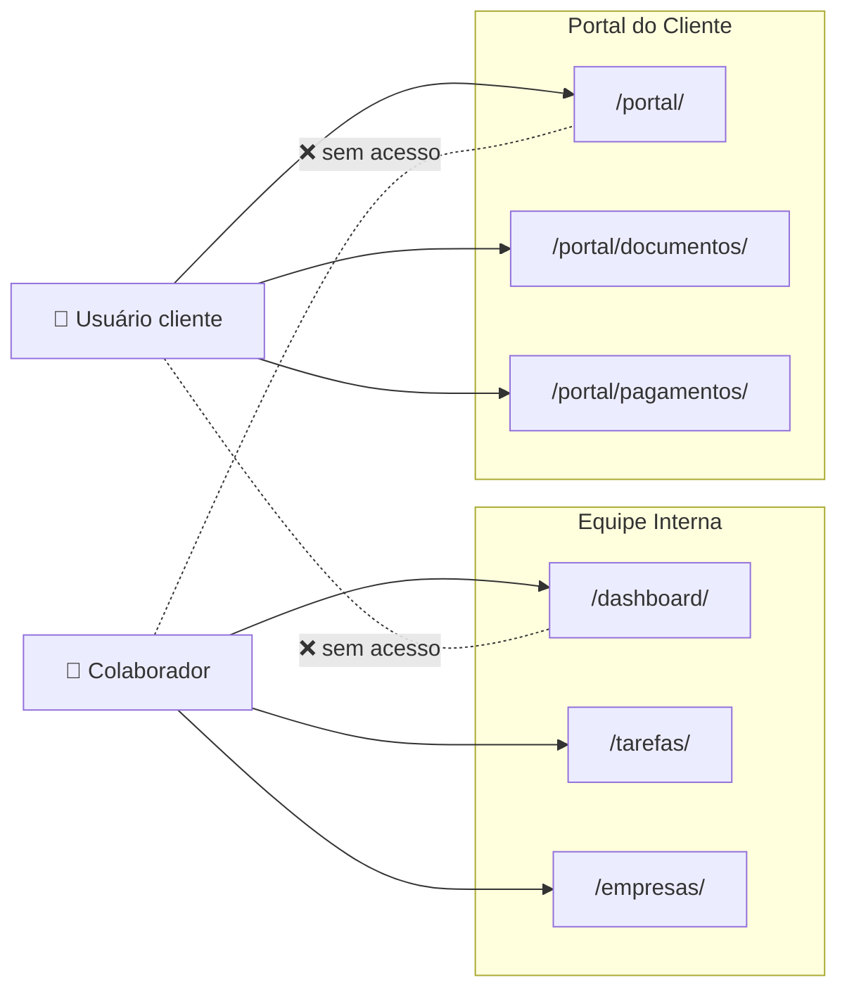

# Perfis e Permissões

[[index|← Início]] · [[api-referencia|API]]

## Perfis de Usuário

O sistema possui **5 perfis** hierárquicos, definidos no campo `perfil` do modelo `Usuario`.

```mermaid
graph TD
    A["👑 admin\nAdministrador"] --> B["📊 manager\nGestor"]
    B --> C["🔬 analyst\nAnalista"]
    C --> D["🛠️ assistant\nAssistente"]
    style E fill:#2D1E2D,stroke:#9B59B6
    E["🏢 client\nCliente"]
```

| Perfil | Código | Descrição |
|--------|--------|-----------|
| Administrador | `admin` | Acesso total. Gerencia usuários, pode fazer tudo. |
| Gestor | `manager` | Cria e gerencia tarefas, acessa dashboards gerenciais, relatórios, metas. |
| Analista | `analyst` | Trabalha com tarefas, registra horas, acessa dashboard individual. |
| Assistente | `assistant` | Mesmas permissões do analista. Nível hierárquico diferente. |
| Cliente | `client` | Acesso exclusivo ao Portal do Cliente. Não vê a operação interna. |

---

## Classes de Permissão (DRF)

| Classe | Lógica | Usada em |
|--------|--------|----------|
| `AllowAny` | Sem restrição | Login |
| `IsAuthenticated` | Sessão válida | Auth/me, dashboard individual |
| `IsAdministrador` | `perfil == 'admin'` | CRUD de usuários |
| `IsGestorOuAcima` | `perfil in ['admin', 'manager']` | Tarefas (delete), empresas (create/update), dashboard geral, relatórios |
| `IsEquipeInterna` | `perfil != 'client'` e `is_active` | Tarefas (CRUD), post-its, tags |
| `IsCliente` | `perfil == 'client'` e `empresa != null` | Portal do cliente |

---

## Matriz de Acesso por Funcionalidade

### Tarefas

| Ação | admin | manager | analyst | assistant | client |
|------|:-----:|:-------:|:-------:|:---------:|:------:|
| Listar | ✅ | ✅ | ✅ | ✅ | ❌ |
| Criar | ✅ | ✅ | ✅ | ✅ | ❌ |
| Ver detalhes | ✅ | ✅ | ✅ | ✅ | ❌ |
| Editar | ✅ | ✅ | ✅ | ✅ | ❌ |
| **Excluir** | ✅ | ✅ | ❌ | ❌ | ❌ |
| Concluir / Reabrir | ✅ | ✅ | ✅ | ✅ | ❌ |
| Timer | ✅ | ✅ | ✅ | ✅ | ❌ |
| Checklist | ✅ | ✅ | ✅ | ✅ | ❌ |
| Comentários | ✅ | ✅ | ✅ | ✅ | ❌ |

### Empresas e Finanças

| Ação | admin | manager | analyst | assistant | client |
|------|:-----:|:-------:|:-------:|:---------:|:------:|
| Listar todas as empresas | ✅ | ✅ | ❌ | ❌ | ❌ |
| Ver empresas designadas | ✅ | ✅ | ✅¹ | ✅¹ | ❌ |
| Criar / Editar empresa | ✅ | ✅ | ❌ | ❌ | ❌ |
| Vincular colaboradores à empresa | ✅ | ✅ | ❌ | ❌ | ❌ |
| Ver pagamentos | ✅ | ✅ | ✅¹ | ✅¹ | ❌ |
| Registrar pagamento | ✅ | ✅ | ❌ | ❌ | ❌ |
| Ver vencimentos ContaAzul | ✅ | ✅ | ✅¹ | ✅¹ | ❌ |
| Conectar / Sincronizar ContaAzul | ✅ | ✅ | ❌ | ❌ | ❌ |

> ¹ Analistas e assistentes veem **apenas** os dados das empresas às quais foram designados como colaboradores.

### Dashboard

| Ação | admin | manager | analyst | assistant | client |
|------|:-----:|:-------:|:-------:|:---------:|:------:|
| Dashboard individual (próprio) | ✅ | ✅ | ✅ | ✅ | ❌ |
| Dashboard individual (outros) | ✅ | ✅ | ❌ | ❌ | ❌ |
| **Dashboard Geral** | ✅ | ✅ | ❌ | ❌ | ❌ |
| **Dashboard Colaboradores** | ✅ | ✅ | ❌ | ❌ | ❌ |
| Metas mensais (CRUD) | ✅ | ✅ | ❌ | ❌ | ❌ |

### Relatórios

| Ação | admin | manager | analyst | assistant | client |
|------|:-----:|:-------:|:-------:|:---------:|:------:|
| Gerar PDF de tarefas | ✅ | ✅ | ❌ | ❌ | ❌ |
| Gerar PDF por colaborador | ✅ | ✅ | ❌ | ❌ | ❌ |

### Usuários

| Ação | admin | manager | analyst | assistant | client |
|------|:-----:|:-------:|:-------:|:---------:|:------:|
| Listar equipe interna | ✅ | ✅ | ✅ | ✅ | ❌ |
| **Criar usuário** | ✅ | ❌ | ❌ | ❌ | ❌ |
| **Editar usuário** | ✅ | ❌ | ❌ | ❌ | ❌ |
| **Desativar usuário** | ✅ | ❌ | ❌ | ❌ | ❌ |
| Editar próprio perfil | ✅ | ✅ | ✅ | ✅ | ✅ |

### Portal do Cliente

| Ação | admin | manager | analyst | assistant | client |
|------|:-----:|:-------:|:-------:|:---------:|:------:|
| Acessar portal | ❌ | ❌ | ❌ | ❌ | ✅ |
| Ver documentos próprios | ❌ | ❌ | ❌ | ❌ | ✅ |
| **Gerenciar documentos** | ✅ | ✅ | ❌ | ❌ | ❌ |
| Ver pagamentos próprios | ❌ | ❌ | ❌ | ❌ | ✅ |
| Solicitar boleto | ❌ | ❌ | ❌ | ❌ | ✅ |
| **Atualizar status de boleto** | ✅ | ✅ | ❌ | ❌ | ❌ |

### Post-its

| Ação | admin | manager | analyst | assistant | client |
|------|:-----:|:-------:|:-------:|:---------:|:------:|
| Ver post-its da equipe | ✅ | ✅ | ✅ | ✅ | ❌ |
| Criar post-it | ✅ | ✅ | ✅ | ✅ | ❌ |
| Editar / excluir próprio | ✅ | ✅ | ✅ | ✅ | ❌ |
| **Excluir de terceiros** | ✅ | ✅ | ❌ | ❌ | ❌ |

---

## Isolamento do Portal do Cliente

Clientes estão totalmente isolados da operação interna:

A separação é garantida por:
1. URL namespace diferente (`/portal/` vs raiz)
2. Permission class `IsCliente` vs `IsEquipeInterna` mutuamente exclusivas
3. Dados filtrados pela `empresa` do usuário logado

---

Próximo: [[fluxos]]
